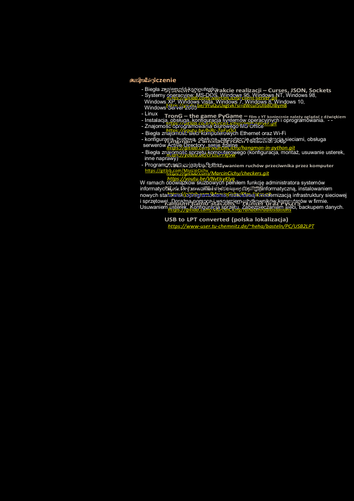
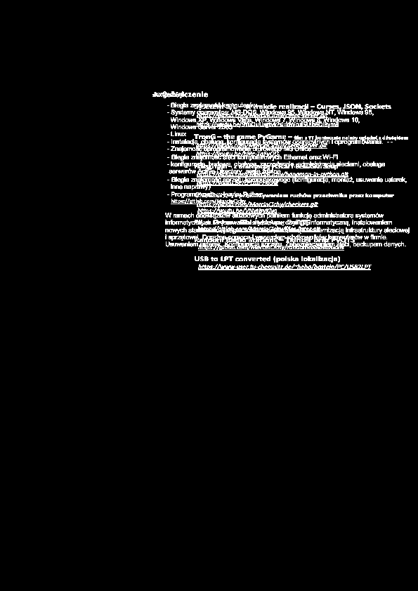

# PDF Comparator v2.0

PDF Comparator v2.0 is a PyQt5-based desktop application designed to visually compare two PDF files. It highlights differences between the PDFs, allowing users to quickly identify changes or discrepancies. The application also includes additional features like sensitivity adjustment, file preview, and printing options.

## Features

- **PDF Comparison**: Compare two PDF files and highlight differences using visual markers.
- **Custom Sensitivity**: Adjust sensitivity to fine-tune the detection of differences.
- **Drag-and-Zoom**: Interactive view of the compared images with mouse drag and zoom.
- **PDF Preview**: Preview the loaded PDF files before comparison.
- **Result Printing**: Print the comparison result directly from the application.
- **Error Handling**: Robust error handling with descriptive messages for user convenience.
- **Test Mode**: Save intermediate results and debug data during the comparison process.

## Requirements

To run this application, the following software and libraries are required:

- Python 3.8 or higher
- PyQt5
- Fitz (PyMuPDF)
- Pillow
- NumPy
- OpenCV

## Installation

1. Clone this repository or download the project files:
   ```bash
   git clone <repository-url>
   ```

2. Navigate to the project directory:
   ```bash
   cd ComparePDF
   ```

3. Install the required dependencies:
   ```bash
   pip install -r requirements.txt
   ```

4. Run the application:
   ```bash
   python main.py
   ```

## File Structure

```
ComparePDF/
|
|-- graphics_view.py     # Custom QGraphicsView class for image display
|-- main.py              # Entry point of the application
|-- pdf_comparer.py      # Main GUI logic and application features
|-- utils.py             # Utility functions for image and PDF processing
|-- requirements.txt     # List of dependencies
|-- app.log              # Application logs (created at runtime)
```

## Usage

1. Launch the application by running `main.py`.
2. Load the first and second PDF files using the provided buttons.
3. Select the base file for comparison using the radio buttons.
4. Adjust the sensitivity slider to fine-tune the comparison.
5. Click the "Compare" button to generate the difference image.
6. View the highlighted differences and optionally print the results.

## Test Mode (`testing_mode`)

The application provides a test mode to save intermediate images and data during the comparison process. This mode is useful for debugging and analyzing how the program processes the PDF files.

### Generated Files in Test Mode

#### 1. `preview_1_test.png` and `preview_2_test.png`

- **Description**: These are previews of the loaded PDF files, converted into images.
- **Purpose**: Verify that the PDFs were correctly loaded and converted into images.
- **Example**:

   
   

#### 2. `image_difference_grayscale_test.png`

- **Description**: A grayscale image showing the raw pixel differences between the two PDFs.
- **Purpose**: Darker pixels indicate smaller differences, while brighter pixels indicate larger differences.
- **Example**:

   

#### 3. `image_difference_thresholded_test.png`

- **Description**: A binary image highlighting significant differences. White pixels represent differences above the sensitivity threshold, while black pixels represent no difference.
- **Purpose**: Focus on critical differences after applying sensitivity thresholding.
- **Example**:

   

#### 4. `difference_matrix_test.txt`

- **Description**: A textual representation of the binary difference image as a matrix. Each number represents a pixel value (0 for no difference, 255 for significant difference).
- **Purpose**: Useful for further data analysis or debugging.
- **Example**: Contents of the file:
   ```
   0 0 0 255 255
   0 0 0 0 255
   255 255 0 0 0
   ```

#### 5. `result_image_test.png`

- **Description**: The final result image with rectangles drawn around the detected differences.
- **Purpose**: Highlight significant differences directly on the base image.
- **Example**:

   

#### 6. `original_image_test.png`

- **Description**: A copy of the base PDF image before any differences are marked.
- **Purpose**: Serves as a reference for the original state of the base image.
- **Example**:

   

### How to Enable Test Mode

1. Open the `pdf_comparer.py` file.
2. In the `PDFComparer` class, set the `self.testing_mode` attribute to `True`:
   ```python
   self.testing_mode = True  # Enable test mode
   ```
3. Run the application as usual. Test files will be saved in the current working directory.

## Troubleshooting

- Ensure that the required dependencies are installed.
- Use PDF files with standard encoding. Encrypted or malformed PDFs might cause errors.
- For large files or high-resolution comparisons, ensure sufficient system memory.

## Logs

Logs are saved in `app.log` for debugging and troubleshooting purposes. They include detailed messages about application processes and errors.

## Contributing

Feel free to contribute to the project by submitting pull requests or reporting issues. Any enhancements or bug fixes are welcome.

## License

This project is licensed under the MIT License. See the LICENSE file for details.

## Acknowledgments

Special thanks to the developers of PyQt5, PyMuPDF, and other libraries that make this project possible.

Additionally, this application was created with significant assistance from AI, specifically OpenAI's ChatGPT, to streamline the development process.